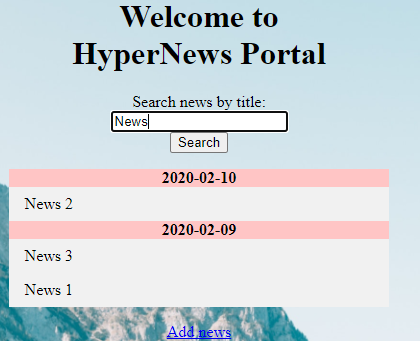
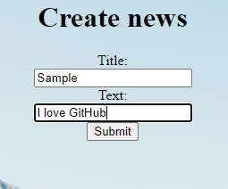

# HyperNews-Portal
JetBrains Academy project course  
Web App created with HTML, CSS and Django  
Provides users to search for news and create their own ones  

### Requirements
1.Python  
2.Django

### Running  

```commandline
python manage.py runserver
```

### How does it look?
Main screen: 


Search:  


Create news:  



